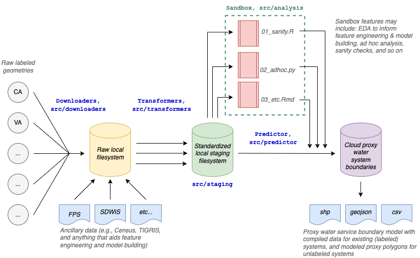

# USA Water Service Boundary Proxy 

_Last updated 2022-01-18_  

## Project Background  

Water service boundaries (spatial polygons) delineate areas over which water is delivered from water systems to customers. Across the USA, some states (e.g., CA, TX, PA) maintain centralized water system boundary (henceforth, **wsb**) databases and make these accessible to the public. Publicly-accessible wsb data is not easily discoverable or cataloged for all states. In this work, we build a reproducible pipeline to assimilate existing wsb data in the USA (labeled data). We then engineer features that predict the approximate spatial extent of these boundaries and train statistical and machine learning models on these features to produce proxy water system boundaries for states without centralized wsb data.  

## Project Organization

The main function of the project is an ETM (extract-transform-model) **pipeline** that chains a set of modular programs which can be flexibly modified over time to accommodate changes in input data and required output results. The main output in `/proxywsb` is a filesystem of various spatial formats (e.g., shp, geojson, csv, rds) that makes results of the proxy wsb model and labeled wsb data available for download and use. 

Download and transform data processing steps are modularized into separate processes in the `/src/downloaders` and `src/transformers` directories that can be modified and run in parallel, with no dependencies on one another. Downloaders pull raw data from the web to a local filesystem, transformers clean, standardize and join that data, and then write it to `data/staging`. Finally, a model reads the staged and standardized data and outputs a wsb proxy layer to `/proxywsb`. All data in this project is quite small and should easily fit into memory and on a PC.   

Exploratory data analysis (EDA), sanity checks, and feature engineering experimentation occur in the **sandbox** (`src/analysis`) and are modularized into iterative notebooks and scripts that can serve multiple objectives without interfering with the functionality of the main ETM pipeline (i.e., `src/run.py`). This makes it easy to create and archive new analyses that serve a purpose, but that may never become productionized.  

The data science **contributor guide** `src/analysis/README.md` is a set of organizing guidelines for how EDA, analyses, and modeled output occur should be conducted in the **sandbox**.  

The overall **pipeline** is shown below:  

 


## Getting started

Clone this repo.  

Install `R version 4.1.0`. Download packages as necessary. We rely only on version-stable CRAN packages. 

Set environmental variables in two files: `.env` (python) and `.Renviron` (R).  

In `R`, run `usethis::edit_r_environ(scope = "project")`. Don't forget to leave a blank line at the end before saving.  

```
WSB_DATA_PATH = "path to save raw data from downloaders"
WSB_STAGING_PATH = "path to stage post-transformer data for EDA and modeling"
WSB_EPSG = "ESRI:102003"
```

`WSB_DATA_PATH` is where we save raw data from the downloaders, which may grow sizable and be better placed off disk.  

`WSB_STAGING_PATH` is where we stage post-transformed for EDA and modeling.  

`WSB_EPSG` is the coordinate reference system (CRS) used by transformers. We currently use [Albers Equal Area Conic projected CRS](https://epsg.io/102003) for equal area calculations. For AK and HI, we need to shift geometry into this CRS so area calculations are minimally distorted, see `tigris::shift_geometry(d, preserve_area = TRUE)` at [this webpage](https://walker-data.com/census-r/census-geographic-data-and-applications-in-r.html#shifting-and-rescaling-geometry-for-national-us-mapping). 


## Python venv and requirements

Create a virtual environment, activate it, and install package dependencies:  

On Windows:  

```
python -m venv .venv
.venv/scripts/activate.bat
pip install -r requirements.txt
```

On OSX/Linux:  

With conda:
```
conda install -n sl
conda activate sl
```

with venv
```
python -m venv .venv
source .venv/bin/activate
pip install -r requirements.txt
```

Install `aria` for downloading files:  

```
brew install aria2
```

Self-solve system-specific issues.  


## R requirements

Download RStudio, then open `wsb.RProject` in RStudio. This will bootstrap `renv`. Next, in the R console, run `renv::restore()` to install R package dependencies and self-solve system-specific issues.  


## Contributing 

To contribute to the project, please branch from `develop` or a subbrach of `develop` and submit a pull request. To be considered as a maintainer, please contact Jess Goddard <jess at gosimplelab dot com>. 
