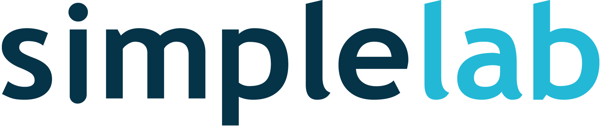
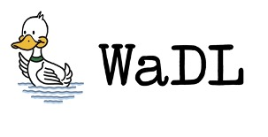
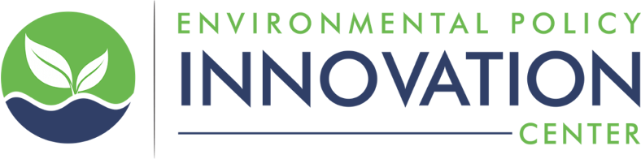

# Credits

The repository and code herein was organized, directed, and developed by SimpleLab, Inc. As this is an MIT License, the repository code and data herein can be reused and re-purposed.

[SimpleLab website](www.gosimplelab.com)

## Collaboration

Water Data Lab contributed technical code and methods development for the initial development of this repository and the TEMM methodology.

[WaDL website](https://www.waterdatalab.com/)

Environmental Policy Innovation Center (EPIC) financed and supported engagement with the initial development of this repository from February-April, 2022 as part of their efforts with the Justice40 Initiative.

[EPIC website](https://www.policyinnovation.org/)

Internet of Water (IoW) provided technical advising and feedback on the approach and is collaborating with as part of the broader effort to expand use and improvement of water service boundaries.

[IoW](https://internetofwater.org/)

For more information about this project, please contact Jess Goddard at \<jess at gosimplelab dot com\>.
