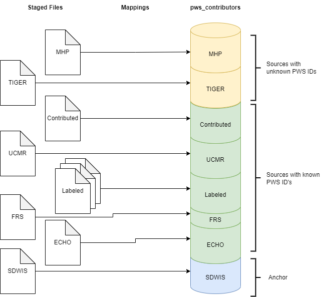

# Included in this document:

* [Running the Matching](#running-the-matching)
* [Methodology](#methodology)
* [Notes on Matching Challenges](#notes-on-matching-challenges)

# Running the Matching

## Run the mappings

This step should occur after running the downloaders and transformers, found elsewhere in the repo. These mappings transform all the data sources into a single model and stack them up on top of each other so they can be easily matched together and compared. They are loaded into the table `pws_contributors` in PostGIS.

Run this script to execute all of the mappings:

`1 - mappings.py`

## Run the matching

Step through this script to match the data together:

`2 - matching.py`

Each match rule attempts to connect one or more of the systems with known PWS ID's (ECHO, FRS, SDWIS, UCMR) to one or more of the systems with unknown PWS ID's (TIGER, MHP). Since we don't know the PWS ID's, we rely on a variety of matches, such as state+name matches or spatial matches.

Once the matches are discovered, they are saved to the database.

## Optionally: Generate the match report
Step through this script to generate match reports:

`analysis/sandbox/matching/match_reports.py`

These reports allow you to browse the matches to develop an intuition of which match rules were successful and which ones weren't. It can be pretty hard to tell sometimes!

## Run the Superjoin

`3 - superjoin.py`

The "superjoin" takes all of these candidate matches and attempts to pick the best ones, yielding a single file where each PWS has a "best" lat/long (from ECHO, UCMR, or MHP), matches to exactly 0 or 1 TIGER, and exactly 0 or 1 MHP. 

# Methodology

We have several data sources that contain opinions about PWS's, such as their name, addresses, lat/long, and boundaries. These different data sources vary in quality and comprehensiveness.

For example, SDWIS is the "system of record" for identifying which PWS's exist and what their PWS ID's are; but it does not contain lat/long, and the addresses stored in SDWIS are often low-quality PO Boxes or administrative addresses, rather than the address of the water system itself.

ECHO contains lat/long, but it is also frequently low-quality. In many cases, it simply provides the centroid for the zip code, county, or state in which the facility is located.

Since each of these data sources have some information to contribute, they will be known as **contributors**. Ultimately, we hope to create a CSV where each row represents a single, unique public water system, and the best attributes have been selected from each of the contributors to create a **master record**. These master records are uniquely identified by their PWS ID's.

In order to create the most complete master records, we need to link as many contributors as possible to their corresponding master records. Some of our data sources (SDWIS, ECHO, FRS, and UCMR) are labeled with PWS ID's, which make them easy to match together. Other data sources (MHP, TIGER) do not have PWS ID's, so we have to rely on other attributes, fuzzier match logic, and various manual and automatic reviews to try to match these to their relevant PWS ID's.

The process for matching these together is described below.

## Mapping
Map all the data sources into a standard model, unioned on top of one another. That is, instead of one system having a column "pws_name" and another system having a column "FacName", we simply standardize them all to "name". This allows us to compare differences across the systems easily. Stacking them in a single table allows us to apply various sorts and joins that identify potential matches.

Since all the records are being stacked, we populate a few additional fields to help track their lineage:
- `source_system` - The name of the data source that contributed the row
- `source_system_id` - The ID which uniquely identifies the row within the source system
- `contributor_id` - An ID which uniquely identifies the record across _all_ systems. It is created by concatenating the `source_system` with the `source_system_id`,
- `master_key` - When we know the PWS ID for a particular row, that is the "master key" for the row. When we don't know the PWS ID, we store an arbitrary unique ID.

## Cleansing
Apply various "cleansing" steps to improve data quality and improve the matching. For example, all text fields are upper-cased. PO Boxes are removed from the address field, because we only care about actual facility addresses. Nonexistent zip codes (99999) are removed. These rules can be expanded in many ways to improve the quality of the data.

## Tokenizing
We create "tokens" to prepare for matching. If we're trying to match facility names together, the names "LAKE WALES, CITY OF" and "LAKE WALES" would not match by default. But we can apply a series of string modifications to reduce these variations and increase the likelihood of matching.

Our tokenization function:
1. Removes common terms like "CITY OF", "COMMUNITY WATER SYSTEM", "WSD", etc.
2. Removes punctuation.
3. Replaces multiple-whitespace characters with a single cahracter.
4. Trims off whitespace from beginning / end of the string.

After these steps, "LAKE WALES, CITY OF" and "LAKE WALES" will both become "LAKE WALES" and matching will be more effective.

## Matching
Then we run a series of match rules. Each rule is implemented as a simple join between tables. On the left side, we usually have one or more of our "anchor" systems (SDWIS, ECHO, FRS) in which we already know the PWS ID. On the right side, we have the "candidate" systems (TIGER, MHP) in which we don't know the PWS ID. Then we set a variety of criteria constraining how the join works.

For example, on the state+name match, we constrain the left side to only SDWIS, ECHO, and FRS rows in which the "state" and the "name_tkn" (containing the results of the name tokenization function) fields are populated. We constrain the right side to only TIGER and MHP rows in which "state" and "name_tkn" are populated. We then join the left to the right side where both sides match on "state" and "name_tkn". This gives us a series of "match pairs" between contributors.

Since there are often multiple contributors on the left side for the same PWS ID, we end up with some duplication. So we simplify these match pairs by converting the left contributor ID to its master key, then group them up. We end up with a table containing: master key (the unique PWS identifier), candidate_contributor_id (the contributor that *might* be linked to the master), and match_rule (the reasons these two records matched). We save this resulting table to the database.

There is a problem, though: Our matching generates only _candidate matches_, meaning, we don't know for sure that they are accurate matches. Depending on how we tighten or loosen our match rules, we are bound to get some number of accurate matches, and some number of inaccurate matches. It is an area of ongoing refinement to try to maximize the accurate matches and minimize inaccurate ones.

## Reporting
To determine whether our match rules are generating accurate matches, we generate a few reports for manual review.

The **stacked match report** displays groupings of contributors so that you can easily compare their attributes and determine if they belong together. Once the report has been exported to Excel, apply a conditional formatting rule on the "Color" column to get color bands visually indicating the match groups.

The **unmatched report** displays a long list of the records that did not successfully match to anything. You can manually sort and comb through this data to see if you can identify the correct matches, and develop intuitions as to why they did not match.

## Superjoin
Finally, the superjoin brings things all together, taking the best attributes from the different data sources.

An important part of this is selecting the "best" match from our sources that do not have PWSID's. Our matching generated only have _candidate matches_, which may or may not be correct, and that allows for issues like one PWS matching to multiple TIGER's -- which cannot happen in the real world. As a result, we have to implement some logic to that chooses the "best" match. We take our best stab at this in the superjoin script by using the labeled data to "score" the various match rules and match rule combinations. We then rank _all_ the matches according to these scores and select the best one for each PWS. This logic should be studied for quality and refined over time.

In total, the superjoin brings together the following data from various sources:

Column                   | Data Source     | Description
-------------------------|-----------------|-----------------
pwsid                    | SDWIS           |
pws_name                 | SDWIS           |
primacy_agency_code      | SDWIS           |
state_code               | SDWIS           |
city_served              | SDWIS           |
county_served            | SDWIS           |
population_served_count  | SDWIS           |
service_connections_count| SDWIS           |
service_area_type_code   | SDWIS           |
owner_type_code          | SDWIS           |
centroid_lat             | MHP, UCMR, ECHO | Lat / Long from the best system is available
centroid_lon             | MHP, UCMR, ECHO | Lat / Long from the best system is available
tiger_match_geoid        | TIGER           | ID of the best match in the TIGER system
pws_to_tiger_match_count | Match Algorithm | Count of how many TIGER records this PWS matched to
tiger_to_pws_match_count | Match Algorithm | Count of how many other PWS records this TIGER matched to
mhp_id                   | MHP             | ID of the best match in the MHP system

# Notes on Matching Challenges
## Matching PWS to TIGER

* 1 PWS matches to multiple tigers
    * Solution: Rank the match rules by evaluating quality against labeled data, then use those ranks to select a "best match" TIGER

* 1 TIGER matches to many PWS
    * No solution explored yet.

## Match PWS to MHP
* Many MHP entries have no name
* Administrative addresses in SDWIS and (occasionally) MHP datasets make it difficult to rely on
* MHP's are unlikely to match TIGER boundaries, so we do not leverage the MHP points 

## Match PWS --> UCMR --> TIGER
* UCMR's often contain multiple zip codes. We calculate the centroid for all of them. We will only use the UCMR centroid if the echo centroid appears to be lower quality.